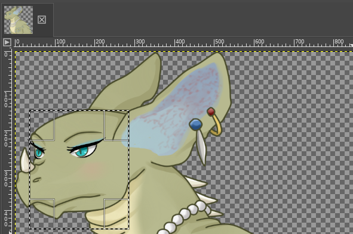

## Introduction

This post will cover how Ren'Py can crop and scale image assets to provide slick and accessible image hints for the speaking character without exporting hundreds of copies of what's already in the game. We do this using Ren'Py's "Side Images" system in collaboration `display.im` image combinators that provides near-infinite possibilities for cropping, scaling, and flipping assets.[^0]

[^0]: While technically infinite because you're able to use floating-point numbers for position selection, you'll find it tends to use very fast bilinear interpolation to scale images, which can quickly cause artifacts for subpixel work. This is why I've opted almost universally to use integer pixel coordinates when I define my displayables.

First, let's start with some history. Shortly after publishing my [first mod](https://steamcommunity.com/sharedfiles/filedetails/?id=2506645207) in the Angels with Scaly Wings ([AwSW](https://angelswithscalywings.com/)) modding community, I was informed of the *Side Faces* mod made by CalamityLime, now removed from the internet. This mod was made by manually cutting every character's face out of their different sprite expression files using an image editor, then aligning them to be used as face boxes in the lower left corner of the screen when the character is talking. The ability to place boxes in that corner, known as the "side image" system was a native feature of Ren'Py, but required specifically placed and named assets, which were a pain and a half to create I'm sure.

With the original mod already removed by that time, and a dyslexic friend struggling with keeping track of the speaking character, I felt there had to be a better way to do side faces in the Ren'Py engine that wouldn't require replicating that effort. In the end, I did have to write a small amount of code for every character expression, though it was far less work than cutting out every face by hand.

The result was the **Side Images** mod, which I published on the [AwSW Steam Workshop](https://steamcommunity.com/sharedfiles/filedetails/?id=2521431664) and [GitHub](https://github.com/4onen/AwSW-Side-Images)

## Side Images: Results


That's right! Not only do we have the speaking character, we also have their expression provided automatically!

## How to make it happen
In Ren'Py 6.99, as used by AwSW, a *side image* is any image where the *tag* (the first word of the image name) is the word `side`[^1]. Ren'Py will append the tag and expression of the currently speaking character (e.g. `emera laugh b flip`) to create the full image specifier it searches for (e.g. `side emera laugh b flip`.) Taking this image specifier, it loads the associated displayable for that image specifier, which is made accessible to the Ren'Py Say screen (where the character text appears) with the `SideImage()` displayable object.

[^1]: Ren'Py allows changing this tag at init time by setting `config.side_image_prefix_tag`, in case you ever want to develop your own game and change it. Fellow modders, please don't change this in AwSW as it will break my mod. 😅

Thus, to add expressions to the AwSW characters, all I had to do was define the side image specifiers to point at ready-to-use cutouts of the character faces. Great! But how do we cut out the faces?

### Cutting out the faces

One nice part of AwSW's development is that every character image has the exact same size across all expressions, and almost always puts the character in the same spot across those expressions.[^2] This is likely an artefact of the artistry process, as the different expressions appear to be small changes from some base. It may also be intentional, as it has the benefit that changing the character's expression doesn't cause the character to move. Either way, for us, the fact that the expressions for a given character are the same mean we can use the same bounding box for every expression of a character, saving us lots of effort!

[^2]: Some exceptions:

    * Reza pointing a gun to the side, as he is offset when he does so. We can manually adjust the bounding box for that one case.

    * Bryce has multiple issues:

        * Bryce has no angry or sad right-facing image wearing a badge, so we have to use the badgeless image to prevent him suddenly gaining a scar in the side image. 

        * Multiple "Old" (scar-less) images are marked as "flip"ped but actually facing the other way. We have to manually flip these back before cropping.

The space we need to put the character's face into, next to the text, is 250 pixels wide by 300 pixels tall.[^3] All we need to do is load up a given character's sprite in an image editor, choose the box we want, and...

[^3]: AwSW uses a 1920x1080 screen resolution as its base, then Ren'Py scales up or down all of its rendering to fit the window size the game is actually played with. This rebuilding of the image processing pipeline can result in some wild corruptions. Check out what happens if you click quickly between different resolutions in the AwSW settings menu! (At least, that was the case for Windows 10, and MacOS didn't even need you to click quickly, just click once.)



... Oh. The box is smaller than her face.

### The Scale of the Problem

As it turns out, cutting the faces out isn't all we need to do. Most characters' faces are simply larger than the space we want to insert them into, meaning we'll get them strangely cropped down to a rectangle and may only get a fraction of their emotional impact. We need to scale the faces down to fit the box. But if we do that first, then we'll wind up dealing with a coordinate space that doesn't match our editor, and what if the scaling isn't right, and, and, and.

What if we took the box, _then_ scaled it down? If we use a box that's twice the target size, we should have a perfect linear interpolation of two pixels for every pixel in the result, preserving as much detail as we can with as few artifacts as possible.


Much better! Scaling up the crop box, then scaling down the result was actually the trick I used with every single dragon. Interestingly, the humans were all small enough that I could just use the 250x300 box directly.

But now that we've chosen the box, how do we explain that to Ren'Py? Those who remember the first part will also notice she's facing the wrong way. 

### The Code

Ren'Py's `display.im` module provides a number of helpful `ImageBase` objects, which are either a directly loaded image themselves, or take one as input and perform some operation on it. To tell Ren'Py we only need some rectangle out of an image, we use the `Crop()` displayable, which takes an image and a rectangle and returns a new image that is only the rectangle.

I'll demonstrate this in parallel with two different images: one of Emera and one that's a placeholder image with placeholder variable names.

```python
from renpy.display import im
cropped_image = im.Crop("image.png", (x, y, width, height))
cropped_emera = im.Crop("cr/emera_normal.png", (4, 9, 500, 600))
```

The `Crop()` displayable is a subclass of `ImageBase`, so it can be used anywhere an image can be used. We can give the filename to it because its constructor will try to convert its first argument into an `ImageBase`, including by loading the image provided. The rectangle we provide after that is a tuple of four numbers: The `x` and `y` coordinates of the top-left corner of the rectangle, and the `width` and `height` of the rectangle. The `Crop()` displayable will then represent a new image that is only the rectangle we specified. This image can also be passed to other `ImageBase` objects, such as `Scale()`.

```python
scaled_image = im.Scale(cropped_image, new_width, new_height)
scaled_emera = im.Scale(cropped_emera, 250, 300)
```

The `Scale()` displayable takes an image and two numbers, the `width` and `height` of the new image, and returns a new image that is the original image scaled to the new size. This has brought our Emera face down to the right size, but she's still facing the wrong way. We can fix that with the `Flip()` displayable.

```python
flipped_image = im.Flip(image, horizontal=True, vertical=False)
flipped_emera = im.Flip(scaled_emera, horizontal=True)
```

The `Flip()` displayable takes an image and two booleans, `horizontal` and `vertical`, and returns a new image that is the original image flipped horizontally and/or vertically. At least one of them must be `True`, or the `Flip()` displayable will raise an error. (They default to False, so you may leave them off as I've done in the Emera example.)

Putting all of these steps together, we can create a displayable that will take an image, crop it to the right size, scale it down, and flip it horizontally. That looks like this:

```python
image_result = im.Flip(im.Scale(im.Crop(image, (x, y, width, height)), new_width, new_height), horizontal=True)
emera_result = im.Flip(im.Scale(im.Crop("cr/emera_normal.png", (4, 9, 500, 600)), 250, 300), horizontal=True)
```

The final step is to register this displayable with Ren'Py so that it knows the name `side emera normal` refers to this displayable. There are two ways to do this, one in Ren'Py code and one in Python code:

```python
# Ren'Py
# If you are writing your own mod, don't use this one, use the Python one below.
image side image = im.Flip(im.Scale(im.Crop(image, (x, y, width, height)), new_width, new_height), horizontal=True)
image side emera normal = im.Flip(im.Scale(im.Crop("cr/emera_normal.png", (4, 9, 500, 600)), 250, 300), horizontal=True)
```

```python
# ... inside your mod's python file ...

    dependencies = ["?Side Images"] # Add Side Images as an optional dependency

    def mod_load(self):
        # ... other code ...
        if mod_info.has_mod("Side Images"):
            import renpy.exports
            # ... other image definitions ...
            renpy.exports.image("side emera normal",
                im.Flip(
                    im.Scale(
                        im.Crop("cr/emera_normal.png", (4, 9, 500, 600)), 
                        250, 300,
                    ), 
                    horizontal=True,
                )
            )
            # ... other image definitions ...
        # ... the rest of your mod ...
```

That is quite a chunk of code to write for every single expression of every single character. Fortunately, looking at the Ren'Py code, you cans see it has a very regular structure with only a few numbers changing. When I wrote the base Side Images mod, I wrote a script that would generate the code for me from a simple list of all the expressions which is still available on the [Side Images GitHub](https://github.com/4onen/AwSW-Side-Images). (You do _not_ need to use this script to make your own mod; it's a convenience tool for me and utterly unhelpful for anyone else.)

In the python example here, I've also included a check to see if the Side Images mod is installed. This is to allow other mods to use my mod as a flag to indicate that the user wants side images, and then they can install their own specific side images for their mod, and the whole system works together.

### What happens when a character expression doesn't have a side image?
A great thing about Ren'Py's displayable lookup is that, after the tag, choice of an image is split into two parts: required and optional. (See `renpy/display/image.py:654`.) Side image lookup considers all attributes to be optional. The image lookup algorithm will then select the image with the longest set of attributes that all fall into optional. This means we can leave attributes off our side images (e.g. not creating `flip` variants) and the system will still work (it will find the unflipped side image.)

This extends further to a smooth fallback under modded expressions (or simply expressions I forgot to add.) For example, imagine someone adds `emera blush b` and `emera blush b flip` with a mod. By adding the image `side emera` with the same displayable as `side emera normal`, we can imagine the lookup algorithm as trying `side emera blush b flip`, falling back to `side emera blush b`, falling back again to `side emera blush`, then finally selecting our `side emera` for which we do have a side image. We lose Emera's true expression in the side image, but hopefully the spritework onscreen will fill that in -- we're at least still indicating the speaking character and not showing an error to the user.

Finally, this fallback does not override side images added by mods, allowing seamless interoperation to be implemented from their side if they so choose, but without requiring it to still achieve a good user experience.

## Digging Deeper

If all you want to do is make your own side images, you can stop here. If you want to know more about how the engine works, read on!

### How much will all these `Crop`s and `Scale`s and `Flip`s lag my game?

The answer to this may be quite surprising to you, but all the `Crop`s and `Scale`s and `Flip`s are actually _very_ fast. This is because Ren'Py has a very powerful image cache that stores the results of all of these operations. When you use a `Crop()` displayable, Ren'Py will check its cache to see if it already has a cropped version of the image you're asking for. If it does, it will return that image instead of creating a new one. This means that, if you use the same cropped image in multiple places, Ren'Py will only have to crop it once, and then it will be able to use the cached version everywhere else. This is also true for `Scale()` and `Flip()`.

### `ImageBase` vs `Displayable`

Throughout this article I've been using the term displayable for things, even though I specified explicitly that `Crop()`, `Scale()`, and `Flip()` are all `ImageBase`s. This is because `Displayable` is the base class of `ImageBase`; all `ImageBase`s are `Displayable`s, they just explicitly represent an image.

`Displayable`s are the core of Ren'Py's rendering system, and are responsible for all of the rendering that happens onscreen. `Displayable`s are also responsible for the layout of the screen, and can be used to create complex interfaces or animations of images, text, and other elements. `ImageBase`, however, focuses solely on high-efficiency rendering of images and their loading and rendering.

The distinction may sound trivial, but it's important to understand that `ImageBase` is a much lower-level facility. Once something has left the subset that is `ImageBase`, it can no longer be manipulated with things like `Crop()`, `Scale()`, or `Flip()`, nor any of the other useful transforms in `renpy.display.im`. While an `ImageBase` can be used anywhere a `Displayable` is used, the reverse is not true.

Fundamentally, `ImageBase`s are considered to be static images, while `Displayable`s are considered to be dynamic. This is why `ImageBase`s are so much more efficient: they never change, so the game knows they can always be pre-rendered and cached, while `Displayable`s usually must be re-rendered every time they are used. This is also why `ImageBase`s are so much more limited: they can't be changed once they're created, while `Displayable`s can be changed at any time so long as their cache entry is invalidated (handled automatically by all of the combinators Ren'Py provides.)

### How does Ren'Py know which side image to use?

We already went over Ren'Py's image lookup algorithm, but how does it know which character is speaking? The answer is that Ren'Py keeps track of the speaking character's side image in a variable called `_side_image`. This variable is set every interaction (of which the `Say` statement is one example) and is used by the `SideImage()` displayable to choose which side image to display.

A lot at once? Don't worry. We'll keep breaking it down.

#### How does Ren'Py know which character is speaking?

Whenever a character speaks, that line is known as a `Say` statement. (This includes characters that don't have names like the narrators `m` and NVL-narrator `n`.) The `Say` statement is a bunch of code that finishes any unfinished transitions, sets up the game to write out the text of your line, and then pause until the player clicks. One of its key responsibilities, though, is to actually _show_ the text of the line. To do this, it asks the `say` _screen_ to display the text.

The `say` screen is a `Screen` object that represents the layout of the textbox that appears whenever a character is speaking. It is responsible for displaying the text of the line, the name of the character speaking, and the side image of the character speaking. It receives the text of the line and the `Character` object of the speaking character from the `Say` statement, and then gets to choose what to display.

When Side Images fails in AwSW, it's almost always because the line is intentionally not supposed to show a character's name, so the associated `Character` object is not provided. This leads to not having an image tag to look up, which leads to not having a side image to show.

#### How does the `say` screen know what to display?

The AwSW `say` screen is actually a complex, so we'll only look at the part that's relevant to side images. In AwSW's `screens.rpy`, on line 55 (the 2nd to last of the `say` screen) we see the following code:

```python
    if side_image:
        add side_image
    else:
        add SideImage() xalign 0.0 yalign 1.0 
```

This tells us that if the screen was given a `side_image` by the `Say` statement, it will use that one. Otherwise, it will use the `SideImage()` displayable.

In all of AwSW, only the `SideImage()` path is taken.

#### How does the `SideImage()` displayable know what to display?

`SideImage()` is a special displayable that will show whatever displayable is stored in the Ren'Py default variable store's `_side_image` variable. If you try setting this variable yourself, however, you may wind up confused that it doesn't ever show what you put in it. This is because, every interaction (every `Say` statement, every pause) Ren'Py will set the `_side_image` variable to the side image of the speaking character. This means that, if you set it yourself, it will be overwritten the next time a character speaks.

#### How does Ren'Py know which side image to use?

The side image engine is called every time an interaction begins and chooses a new side image based on the speaker of that interaction (See `renpy/common/00sideimage.rpy:63` which calls `renpy/exports.py:2720` which then uses the `choose_image` algorithm from `renpy/display/image.py:654`.)

And that's it! By passing information from the `Say` statement of the current line, Ren'Py can store away the speaking character's side image every single time someone speaks, making sure we always have the right side image for the right character.

#### How does Ren'Py know which _expression_ to use?

If you look closely in the function at `renpy/exports.py:2720`, you'll see that, if given a speaking character's `image_tag`, it will run the lines

```python
image_layer = default_layer(layer, image_tag)
attrs = (image_tag,) + images.get_attributes(image_layer, image_tag)
```

AwSW never uses layers, so we can ignore the first line. The second line asks the layer (always the default) to tell us what attributes the image has. This is what tells us the character's expression! These attributes are then used to choose the side image, through means discussed before.

#### Where does the `_side_image` variable come from?
`renpy/common/00sideimage.rpy` is loaded by the engine during init stage -1650, so before the init blocks of the game, during the Ren'Py-only initialization. It also performs some initialization (by setting some variables) at init +1650. This side image system keeps track of the side image sprite for the speaking character, so that the `SideImage()` displayable in the default store provides the side images to the speaking menu.

## Conclusion

As far as the Side Images system goes, that's all there is to it. The rest of the implementation is just the `SideImage()` displayable and the `side` image tag.

If you'd like to understand more about how Ren'Py works, I recommend starting with the [Ren'Py documentation](https://www.renpy.org/doc/html/). While a bit sparse and increasingly less relevant to AwSW's version of Ren'Py, it still has clear descriptions of many of the objects and tools you'll run across as you begin to delve even deeper into the engine. Good luck!
